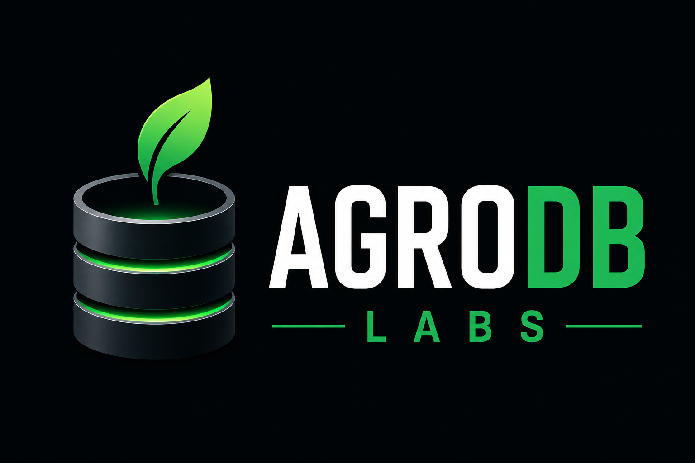

<div align="center">




<br/>

[](https://git.io/typing-svg)

<br/>


</div>

---

## 🌱 Sobre o Projeto

Projeto desenvolvido para estudo de Banco de Dados, PostgreSQL e Administração de Banco de Dados (DBA).

O objetivo é simular um ambiente real de uma empresa do agronegócio, modelando um banco de dados desde o levantamento de requisitos até consultas SQL, otimização e documentação.

> Este é um projeto de aprendizado público. Cada etapa — modelagem, constraints, índices, consultas — é documentada em `docs/jornada_aprendizado.md` conforme evolui.

---

## 🎯 Objetivos

Este projeto tem como finalidade:

- Praticar modelagem de banco de dados.
- Aprender PostgreSQL na prática.
- Aplicar conceitos de normalização e integridade referencial.
- Desenvolver consultas SQL, do básico ao avançado.
- Simular atividades de um DBA (constraints, índices, performance).
- Construir um portfólio profissional.

---

## 🚜 Empresa Fictícia

A **AgroDB Farm** é uma empresa fictícia do setor agrícola responsável pela produção e comercialização de:

<div align="center">

| 🌱 Soja | 🌽 Milho | 🎋 Cana-de-açúcar |
|:---:|:---:|:---:|
| Grão | Grão | Industrial |

</div>

O sistema controla produtores, fazendas, talhões, safras, culturas, produção, clientes, vendas, fornecedores, produtos, estoque, compras, funcionários, máquinas e utilização de máquinas.

---

## 🛠️ Tecnologias

<div align="center">

</div>

<br/>

- **PostgreSQL 17** — banco de dados relacional
- **Docker + Docker Compose** — ambiente containerizado e reprodutível
- **pgAdmin 4** — administração do banco
- **VS Code** — desenvolvimento
- **Git + GitHub** — versionamento

---

## 📁 Estrutura do Projeto

```
AgroDB-Labs
│
├── assets/
│   └── logo.png
│
├── database/
│   ├── schema.sql          → criação das 17 tabelas + constraints
│   ├── indexes.sql         → índices sobre colunas de Foreign Key
│   ├── seed.sql             → dados de exemplo
│   └── queries.sql          → consultas analíticas, por blocos de conceito
│
├── diagrams/
│   ├── modelo_conceitual.drawio
│   └── modelo_conceitual.png
│
├── docker/
│   ├── docker-compose.yml
│   └── .env.example
│
├── docs/
│   ├── arquitetura.md
│   ├── dicionario_dados.md
│   ├── modelo_logico.md
│   ├── modelo_negocio.md
│   ├── padroes_projeto.md
│   ├── comandos.md              → referência de comandos Docker e Git
│   └── jornada_aprendizado.md   → diário de bordo do aprendizado
│
├── .gitignore
└── README.md
```

---

## 🗃️ Modelo de Dados

O banco de dados está organizado em **4 módulos**, totalizando **17 tabelas**:

<table>
<tr>
<td valign="top" width="25%">

**🌾 Produção**

`produtor` → `fazenda` → `talhao` → `safra` → `producao`, relacionadas com `cultura`.

</td>
<td valign="top" width="25%">

**💰 Comercial**

`cliente` → `venda` → `item_venda`, relacionado com `producao`.

</td>
<td valign="top" width="25%">

**📦 Suprimentos**

`fornecedor` → `compra` → `item_compra`, relacionado com `produto` e `estoque`.

</td>
<td valign="top" width="25%">

**⚙️ Operações**

`funcionario`, `maquina` e `utilizacao_maquina`, relacionado com `talhao`.

</td>
</tr>
</table>

### Convenções utilizadas

- `snake_case` em todas as tabelas e colunas, tabelas no singular.
- Chaves primárias com `GENERATED ALWAYS AS IDENTITY` (sem `SERIAL` ou `UUID`).
- Chaves estrangeiras nomeadas como `CONSTRAINT fk_origem_destino`.
- Restrições `UNIQUE` em documentos (CPF/CNPJ) e `CHECK` em valores numéricos.
- Colunas calculadas (`GENERATED ALWAYS AS ... STORED`) para subtotais.
- Índices sobre todas as colunas de Foreign Key.
- `NUMERIC` para valores monetários, áreas, pesos e consumo.
- `DATE` para todas as datas.

---

## ⚡ Como executar o projeto

**1. Clone o repositório:**
```bash
git clone https://github.com/Albfonts/AgroDB-Labs.git
cd AgroDB-Labs
```

**2. Configure as variáveis de ambiente:**
```bash
cd docker
cp .env.example .env
```
Edite o arquivo `.env` com suas próprias credenciais.

**3. Suba os containers:**
```bash
docker-compose up -d
cd ..
```

**4. Acesse o pgAdmin** em `http://localhost:5050` e conecte ao servidor PostgreSQL (host `agrodb-postgres`, porta `5432`).

**5. Execute os scripts na seguinte ordem**, usando o Query Tool do pgAdmin (botão ⚡ "Execute Script"):

| Ordem | Script | O que faz |
|:---:|---|---|
| 1️⃣ | `database/schema.sql` | Cria as 17 tabelas, constraints e colunas calculadas |
| 2️⃣ | `database/indexes.sql` | Cria os índices sobre as colunas de FK |
| 3️⃣ | `database/seed.sql` | Popula o banco com dados de exemplo |
| 4️⃣ | `database/queries.sql` | Consultas analíticas para explorar o modelo |

> 📖 Comandos detalhados de Docker e Git em `docs/comandos.md`.

---

## 🗺️ Roadmap

- [x] Levantamento de requisitos
- [x] Modelagem conceitual
- [x] Modelagem lógica
- [x] Modelagem física
- [x] Criação do schema (constraints `UNIQUE` / `CHECK`)
- [x] Índices sobre Foreign Keys
- [x] Colunas calculadas (`GENERATED`)
- [x] Inserção de dados (seed)
- [x] Ambiente Docker configurado
- [ ] 🔄 Consultas SQL (SELECT, JOIN, GROUP BY, CTE, subconsultas) — **em andamento**
- [ ] Views
- [ ] Procedures e Triggers
- [ ] Backup e Restore
- [ ] Otimização de consultas (EXPLAIN/ANALYZE)

---

## 📚 Documentação

| Arquivo | Conteúdo |
|---|---|
| `docs/modelo_negocio.md` | Visão de negócio, processos e objetivos do sistema |
| `docs/arquitetura.md` | Domínios do sistema e visão de evolução futura |
| `docs/modelo_logico.md` | Descrição completa de todas as tabelas e colunas |
| `docs/dicionario_dados.md` | Dicionário de dados por entidade |
| `docs/padroes_projeto.md` | Convenções de nomenclatura |
| `docs/jornada_aprendizado.md` | Diário de bordo: conceitos estudados e aplicados |
| `docs/comandos.md` | Referência rápida de comandos Docker e Git |

---

## 📊 Status Atual

🚧 **Sprint 2 em desenvolvimento** — modelagem, constraints, índices e ambiente concluídos. Consultas SQL analíticas em construção, seguindo estudo próprio de SQL do básico ao avançado.

---

<div align="center">

## 👤 Autor

**Daniel Albor Fontes**

Estudante de Análise e Desenvolvimento de Sistemas (ADS)
Construindo uma carreira em Administração de Banco de Dados (DBA)

[](https://www.linkedin.com/in/daniel-albor-fontes)
[](https://github.com/Albfonts)

<br/>


</div>